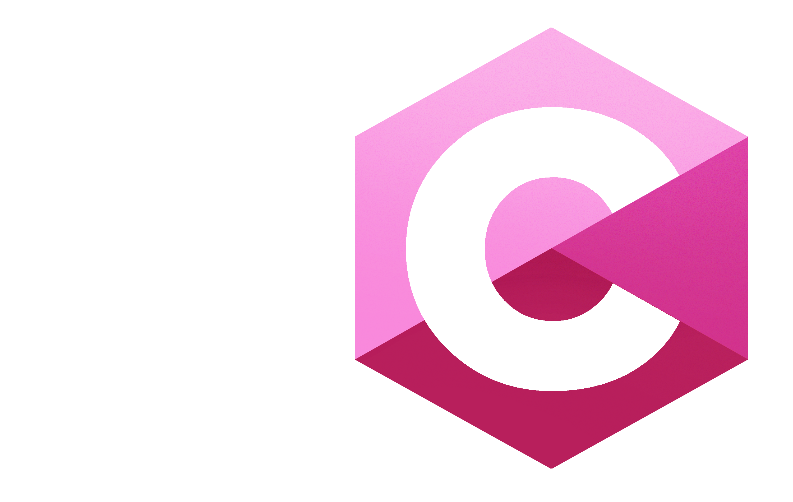

# FemC Lang (CPP Compiler)



This is my project as a personal study with compilers.

femC is a joke with a video game character name, but I'll probably take inspirations from C for the language syntax.

This compiler is written in C++ but hopefully it will get to a point where it can be self-hosted.

This project was based on the Hydrogen programming language by Pixeled, I think the series was descontinued so I made a fork to commit my personal changes to the project and hopefully finish it.

This won't be released! ^^

## Building

Requires `nasm` and `ld` on a Linux operating system.

```bash
git clone https://github.com/JuneGabi/femC
cd femC
mkdir build
cmake -S . -B build
cmake --build build
```

Executable will be `femc` in the `build/` directory.

## Compilation and execution

```bash
./build/femc ./main.femc
./out; echo $?
```
